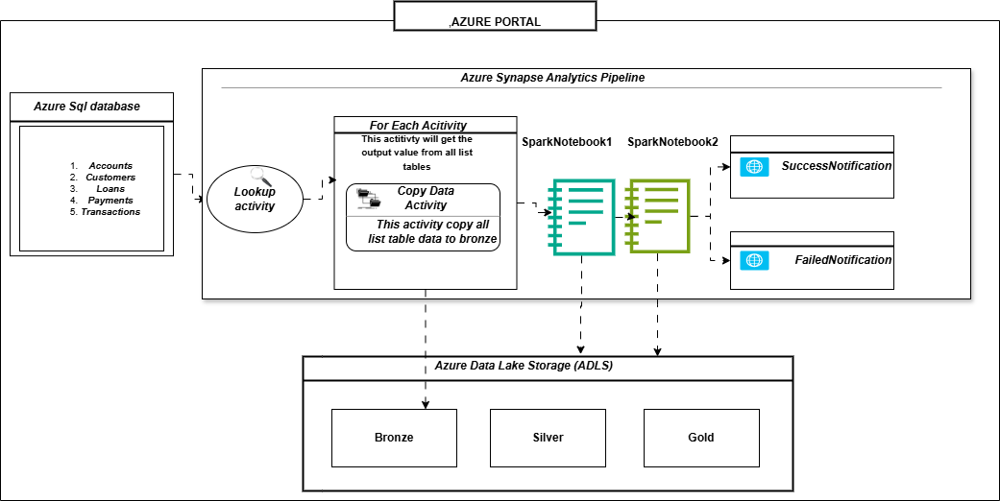

# Fintech_Data_Migration

   
   
   

## PROJECT OVERVIEW

The project automates the process of fetching news articles related to Tesla from the News API, processing this data, and storing it in Google Cloud Storage (GCS) as a Parquet file. This file is later moved to a Snowflake data warehouse for analysis. The project uses Airflow for orchestration, ensuring the data ingestion and processing occur periodically and smoothly.

  

## PROJECT EXPLANATION :-  

### 1. Raw Data Ingestion (Bronze Layer)
The pipeline starts with raw data ingestion into the Bronze Layer, stored as Parquet files in Azure Data Lake Storage (ADLS). The bronze layer contains data from various financial domains:

* Accounts
* Customers
* Loans
* Payments
* Transactions
  
 #### Key Details 
  * The data in this layer is ingested in its original format, ensuring no loss of raw information.
  * It serves as the source of truth for all downstream transformations.

### 2. Transformation and Structuring (Silver Layer)
Using PySpark, the raw data is transformed into structured datasets, which are saved as Delta Tables in the Silver Layer.

 #### Key Transformations:
* <h3>Accounts Dataset:</h3>
  
  Calculate the age of accounts in years from the account opening date.

* <h3>Customers Dataset:</h3>
  
   Concatenate first and last names to form FullName, and mask sensitive email information.

* <h3>Loans Dataset:</h3>
  Compute:

  Total interest using loan amount and interest rate.
  Loan duration in years using start and end dates.
  
 * <h3>Payments Dataset:</h3>
  Add a derived column to calculate the number of days since the last payment.

* <h3>Transactions Dataset:</h3>

  Categorize transactions as "Income," "Expense," or "Other" based on the transaction type.

  The Silver Layer acts as the intermediary step where raw data is enriched and standardized for analytical use.

### 3. Dimensional Modeling and Analytical Data (Gold Layer)
The Gold Layer comprises dimensional and fact tables created from the Silver Layer. These tables are optimized for reporting and analytics.

#### Dimensional Tables:
* Dim_Customers:
  Customer-centric details such as name, email, phone, and address.

* Dim_Accounts:
  Account-specific attributes like account type, balance, and account age.

* Dim_Loans:
  Loan-related details, including loan type, total interest, and duration.

#### Fact Tables:
 * Fact_Payments:
  Combines payment information with customer and loan details for detailed payment analysis.

* Fact_Transactions:
  Links transactional data with accounts and customers to provide insights into spending and income patterns.

### 4. Orchestration and Metadata Management
The entire workflow is automated using SQL scripts and PySpark notebooks, which perform scheduled tasks for ingestion, transformation, and loading.
Schema metadata is managed and retrieved using SQL queries to ensure compatibility and consistency.

### 5. Final Analysis and Reporting
The Gold Layer data, stored in Delta Tables, is now ready for:

* Business Intelligence (BI) tools.
* Detailed reporting and financial insights.
* Predictive analytics for better decision-making.

  
  
  
   
   
      

     

  

 
 
 

## ARCHITECTURE DIAGRAM :-

  

The architecture includes:

* Bronze Layer: Stores raw Parquet files in ADLS.
* Silver Layer: Structured Delta Tables after initial transformations.
* Gold Layer: Analytical tables for reporting and insights.

 
 
 

## TECHNOLOGY USED :-

<h3> SQL:</h3>

Facilitates schema creation, data validation, and metadata retrieval.

<h3>PySpark:</h3>

Handles large-scale transformations and calculations for financial data.

<h3> Azure Synapse Analytics:</h3>

Used for querying, scripting, and integrating the refined data for analytical workloads.

<h3> Azure Data Lake Storage (ADLS):</h3>

Centralized storage for raw (bronze), structured (silver), and analytical (gold) datasets.

<h3>Delta Tables:</h3>

Enables ACID transactions and schema enforcement during data transformation and storage.

 
 
 

## Project Files  :-

* <h3>Pyspark Notebooks:

  ####  Bronze to Silver Transformation :
  [Notebook-1](BronzeToSilverDataProcess.ipynb) 
* Handles the ingestion and transformation of raw datasets.
    
   
  ####  Silver to Gold Transformation :
  [Notebook-2](SilverToGoldDataProcess.ipynb) 
* Converts structured data into analytical tables.

    #### BRONZE:- Raw data
    #### SILVER:- Transform data
    #### GOLD:- Final Aggregated data
 
  
  
 
* <h2>SQL Scripts :</h2>

   ####  Define the source tables and schema for various datasets: :
 * [ACCOUNTS-TABLE](Accounts.sql) 
 * [CUSTOMERS-TABLE](Customers.sql) 
 * [LOANS-TABLE](Loans.sql) 
 * [PAYMENTS-TABLE](Payments.sql) 
 * [TRANSACTIONS-TABLE](Transactions.sql)

   
   

  
### Conclusion
This project demonstrates an efficient approach to financial data processing using Azure and PySpark technologies. The resulting gold-layer tables enable accurate and timely business intelligence to support financial decision-making.

